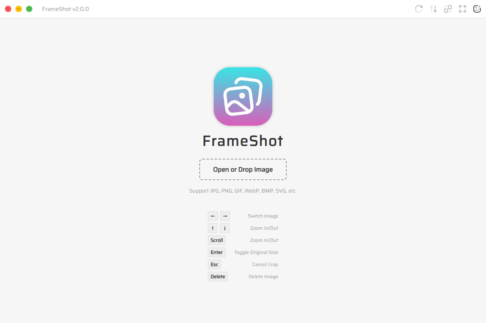

# FrameShot

<p>
  
  
  
  
</p>

A minimal image viewer with zoom, crop, and format conversion, built on Electron. Supports **Windows** · **macOS** · **Linux**. Download from [GitHub Releases](https://github.com/metadream/frameshot/releases).



## Features

- **View & Navigate** — Open images via file dialog, drag-and-drop, or file association. Arrow keys to switch, scroll to zoom.
- **Crop** — Preset aspect ratios (1:1, 3:2, 4:3, 16:9, etc.). Drag to reposition, drag corners to resize. Click the save icon to save.
- **Convert** — Convert to JPEG or PNG with a single click.
- **Delete** — Delete to trash, auto-advance to next image.
- **HEIC/RAW support** — Decodes HEIC, HEIF, TIFF, and RAW via Sharp + heic-convert for formats not natively supported by the browser.

## Usage

| Action | Input |
|--------|-------|
| Open file | Open or Drop image onto window |
| Switch image | `←` `→` |
| Zoom In/Out | `↑` `↓` |
| Zoom In/Out | Scroll wheel |
| Toggle original size | `Enter` |
| Crop (aspect ratio) | Crop menu → drag box → click save icon |
| Cancel crop | `Esc` |
| Delete image | `Delete` (Win/Linux) / `Backspace` (Mac) |

## Project Structure

```
src/
├── main/
│   ├── index.js        # Entry point, window creation, custom protocol
│   ├── ipc.js          # IPC handlers (open, convert, crop, delete, etc.)
│   ├── preload.js      # Context bridge API
│   └── protocol.js     # Image protocol handling
├── renderer/
│   ├── index.js        # Renderer entry, handles file-opened event
│   ├── control.js      # Core logic: open, navigate, sort, crop binding
│   ├── viewer.js       # ImageViewer class: zoom, pan, toggle original
│   ├── cropper.js      # ImageCropper class: crop UI, resize handles, boundary
│   └── utils.js        # Utility functions
├── assets/
│   ├── style.css
│   ├── icons/          # SVG toolbar icons
│   ├── build/          # App icons (ico/icns/png)
│   └── Saira-Regular.ttf
└── index.html
```

## Develop

```bash
git clone https://github.com/metadream/frameshot.git
cd frameshot
npm install
npm start
```

## Build

```bash
npm run build:win    # Windows (NSIS)
npm run build:mac    # macOS (DMG)
npm run build:linux  # Linux (DEB)
```

## Supported Formats

| Format | Native preview | Notes |
|--------|---------------|-------|
| JPEG, PNG, WebP, GIF, BMP, AVIF, SVG | ✅ Direct | Browser-native |
| HEIC, HEIF | ✅ Converted | Requires `heic-convert` |
| TIFF, RAW | ✅ Converted | Requires `sharp` |

## License

MIT
